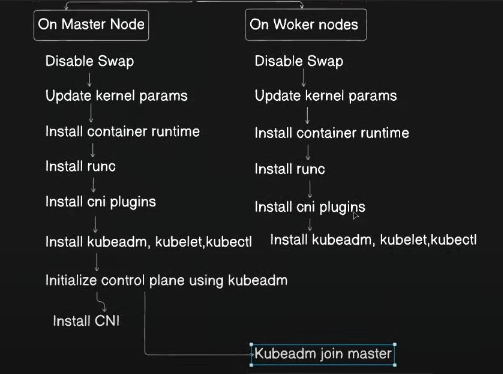
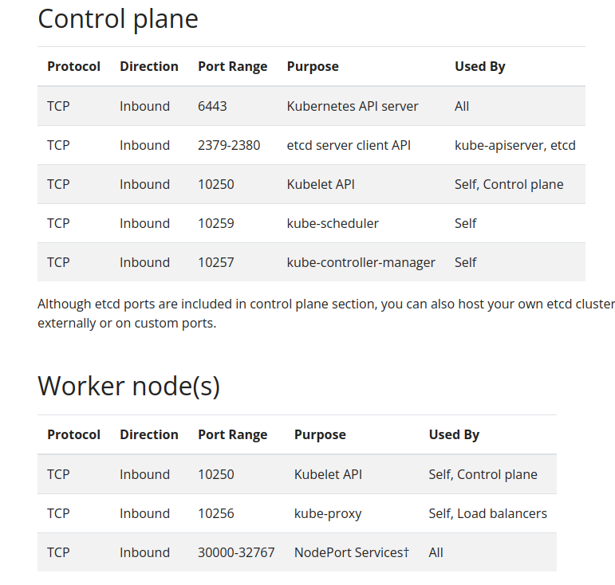

# Kubernetes Cluster set-up using kubeadm

**We need those steps to set up kubernetes.**


# Master node steps
### Step - 01
SSH into master cli \
Open those ports for control plan and worker node



### step - 02 
allow ports in ufw which are describe in this link: https://kubernetes.io/docs/reference/networking/ports-and-protocols/

### Step - 03
Disable swap to every node
```shell
swapoff -a
sudo sed -i '/ swap / s/^\(.*\)$/#\1/g' /etc/fstab
```

### step - 04
create bridge traffic to every node
```shell
cat <<EOF | sudo tee /etc/modules-load.d/k8s.conf
overlay
br_netfilter
EOF

sudo modprobe overlay
sudo modprobe br_netfilter

# sysctl params required by setup, params persist across reboots
cat <<EOF | sudo tee /etc/sysctl.d/k8s.conf
net.bridge.bridge-nf-call-iptables  = 1
net.bridge.bridge-nf-call-ip6tables = 1
net.ipv4.ip_forward                 = 1
EOF

# Apply sysctl params without reboot
sudo sysctl --system

# Verify that the br_netfilter, overlay modules are loaded by running the following commands:
lsmod | grep br_netfilter
lsmod | grep overlay

# Verify that the net.bridge.bridge-nf-call-iptables, net.bridge.bridge-nf-call-ip6tables, and net.ipv4.ip_forward system variables are set to 1 in your sysctl config by running the following command:
sysctl net.bridge.bridge-nf-call-iptables net.bridge.bridge-nf-call-ip6tables net.ipv4.ip_forward
```

### Step - 05
Install container runtime 
```shell
curl -LO https://github.com/containerd/containerd/releases/download/v1.7.14/containerd-1.7.14-linux-amd64.tar.gz
sudo tar Cxzvf /usr/local containerd-1.7.14-linux-amd64.tar.gz
curl -LO https://raw.githubusercontent.com/containerd/containerd/main/containerd.service
sudo mkdir -p /usr/local/lib/systemd/system/
sudo mv containerd.service /usr/local/lib/systemd/system/
sudo mkdir -p /etc/containerd
containerd config default | sudo tee /etc/containerd/config.toml
sudo sed -i 's/SystemdCgroup \= false/SystemdCgroup \= true/g' /etc/containerd/config.toml
sudo systemctl daemon-reload
sudo systemctl enable --now containerd

# Check that containerd service is up and running
systemctl status containerd
```

Open crictl config file `vim /etc/crictl.yaml`

add those line 
```shell
runtime-endpoint: unix:///run/containerd/containerd.sock
image-endpoint: unix:///run/containerd/containerd.sock
```

### Step - 06
Install runc

```shell
curl -LO https://github.com/opencontainers/runc/releases/download/v1.1.12/runc.amd64
sudo install -m 755 runc.amd64 /usr/local/sbin/runc
```

### Step - 07
Install CNI plugin

```shell
curl -LO https://github.com/containernetworking/plugins/releases/download/v1.5.0/cni-plugins-linux-amd64-v1.5.0.tgz
sudo mkdir -p /opt/cni/bin
sudo tar Cxzvf /opt/cni/bin cni-plugins-linux-amd64-v1.5.0.tgz
```

### Step - 08
Install kubeadm, kubectl, kubelet
```shell
sudo apt-get update
sudo apt-get install -y apt-transport-https ca-certificates curl gpg

curl -fsSL https://pkgs.k8s.io/core:/stable:/v1.31/deb/Release.key | sudo gpg --dearmor -o /etc/apt/keyrings/kubernetes-apt-keyring.gpg
echo 'deb [signed-by=/etc/apt/keyrings/kubernetes-apt-keyring.gpg] https://pkgs.k8s.io/core:/stable:/v1.31/deb/ /' | sudo tee /etc/apt/sources.list.d/kubernetes.list

sudo apt-get update
sudo apt-get install -y kubelet=1.31.1-1.1 kubeadm=1.31.1-1.1 kubectl=1.31.1-1.1 --allow-downgrades --allow-change-held-packages
sudo apt-mark hold kubelet kubeadm kubectl

kubeadm version
kubelet --version
kubectl version --client

```

### Step - 09 
Initialize or Bootstrap control plan
```shell
sudo kubeadm init --pod-network-cidr=192.168.0.0/16 --apiserver-advertise-address=192.168.10.24 --node-name master
```
This will generate token and sha256 like `kubeadm join 192.168.10.24:6443 --token izu8yw.bswk5ai1muwvqcuh \
--discovery-token-ca-cert-hash sha256:d7aba407c1b8935ca1d1cc75bb199e672792e26946f587b526fea1415e3cba39`
\ This should copy to a file because it will need to join worker nodes.


### Step - 10
**Control plan initialization**
To start using your cluster, you need to run the following as a regular user:
```shell
  mkdir -p $HOME/.kube
  sudo cp -i /etc/kubernetes/admin.conf $HOME/.kube/config
  sudo chown $(id -u):$(id -g) $HOME/.kube/config
```

OR

need to run this command `export KUBECONFIG=/etc/kubernetes/admin.conf`

### Step - 11
Install calico
```shell
kubectl create -f https://raw.githubusercontent.com/projectcalico/calico/v3.28.0/manifests/tigera-operator.yaml

curl https://raw.githubusercontent.com/projectcalico/calico/v3.28.0/manifests/custom-resources.yaml -O

kubectl apply -f custom-resources.yaml
```


# Worker node steps
Follow step (1-8) as same and step - 11 to install calico. then join to master node (control plan)
```shell
kubeadm join 192.168.10.24:6443 --token qdor3a.csnj5re13tcy591l \
	--discovery-token-ca-cert-hash sha256:67ae212402141d2cfbc176cd5fcd7f812875ce508c64aa1b57b81daefaf9bd8d
```

If we forgot to join token, Then we can regenerate this token using this command
```shell
kubeadm token create --print-join-command
```


* Tigera operator responsible for provisioning calico pod
* reset kubeadm `kubeadm reset`
* `PS1="Worker--->"` change terminal name


